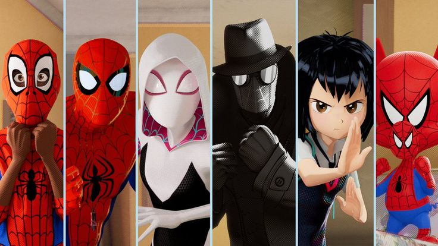
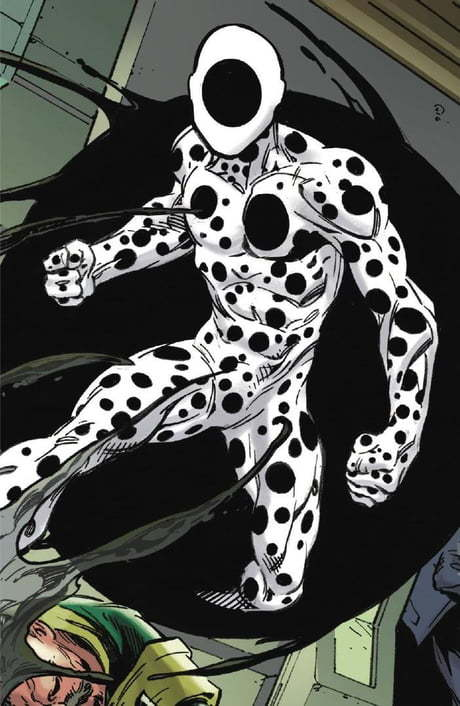

# Week-09-Quiz
## Part 1: Imaging Technique Inspiration

我从电影《蜘蛛侠：平行宇宙》中获得灵感。影片中，每个蜘蛛侠角色都呈现出截然不同的画风风格（例如漫画风、黑白胶片风、赛博朋克风等），这些风格与角色所属的宇宙紧密相关。  
我希望借鉴这一视觉策略，在我的互动项目中根据不同用户或对象的设定，应用不同的视觉风格，以增强表现力和个性表达。

  

---

## Part 2: Coding Technique Exploration

为了实现这种风格化的切换，我选择使用 **p5.js** 中的 `filter()` 函数。该函数允许对画面应用灰度、模糊、反色等预设视觉效果。  
我可以根据用户选择不同角色，自动应用对应的滤镜，快速切换画风。

🔗 示例链接与代码：  
[https://p5js.org/examples/3d-filter-shader/](https://p5js.org/examples/3d-filter-shader/)
