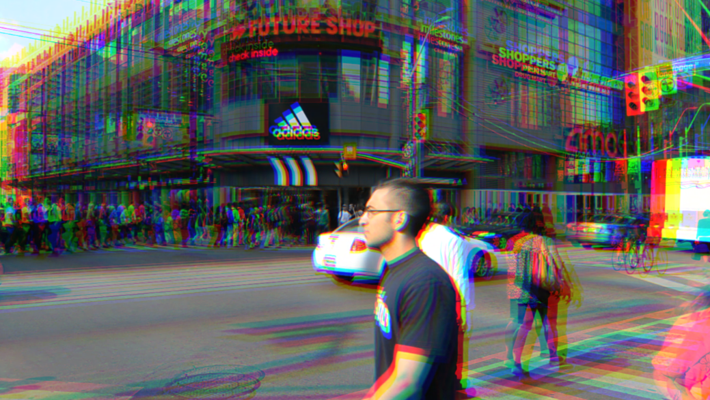

# Week-09-Quiz
## Part 1: Imaging Technique Inspiration

I got inspiration from the movie "Spider-Man: Into the Spider-Verse". In the film, each Spider-Man character presents a completely different art style (such as comic style, black-and-white film style, cyberpunk style, etc.), and these styles are closely related to the universe to which the characters belong.
I hope to draw on this visual strategy and apply different visual styles in my interactive projects based on the Settings of different users or objects to enhance expressiveness and individual expression.

  

---

## Part 2: Coding Technique Exploration

To achieve this stylized switch, I choose to use the 'filter()' function in **p5.js**. This function allows the application of preset visual effects such as grayscale, blur, and reverse color to the picture.
I can automatically apply the corresponding filters based on the different characters selected by the user and quickly switch the art style.

Sample link and code:
[https://p5js.org/examples/3d-filter-shader/](https://p5js.org/examples/3d-filter-shader/)
